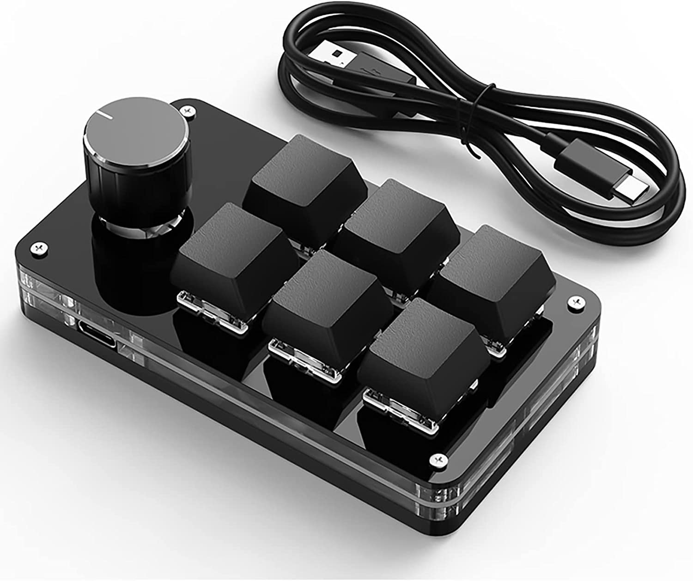

# chinese-mini-keyboard

## これは何？

怪しい中華製の左手デバイスの設定を行うためのツール。
windows 以外で設定することを目的としていますが、windows でもサポートを行う予定です。
(中華製の怪しいソフトウェアを利用したくない人向け)

## 動作（すると思われる）デバイス

以下全て同一商品だと思われる。

- [SIKAI CASE 片手キーボード プログラマブルキーボード メカニカルキーボード USB 有線接続 ノブ 1 個付き 6 キー 左手ゲーミングキーボード ライブコンテンツ作成コントローラー カスタム可能なキー 片手 小型キーボード ショットカットキー プログラマー向き DIY キーボード Windows/VISTA/Linux/Mac に適用 オフィス/ゲーム/音楽/メディア/作業制御に最適 (6 キー, 黒)](https://www.amazon.co.jp/gp/product/B09Y5LCZRD)
- [マクロ-Bluetooth キーボード用のプログラム可能なキー 3/6,ホットスワップ,ミニメカニカル Bluetooth キーボード](https://ja.aliexpress.com/item/1005004748558819.html)
  - 作成にあたり動作検証したのはこちらで購入したもの。



## 利用方法

### キーボードショートカットを設定する

利用できるキーに関しては[keys.go](./keys.go)を参照。
利用できるボタンに関しては[buttons.go](./buttons.go)を参照。

> 備考：modifier を設定できるのは一番最初のキーのみです。（おそらく HW 製薬）

```
> sudo ./chinese-mini-keyboard key KEY1 ctrl+c
> sudo ./chinese-mini-keyboard key KEY2 ctrl+v
> sudo ./chinese-mini-keyboard key KEY3 ctrl+t a // ctrl+t → a (ctrl+t → ctrl+a とはならない)
> sudo ./chinese-mini-keyboard key K1_LEFT volumeadd // つまみ左
> sudo ./chinese-mini-keyboard key K1_CENTER mute // つまみ押
> sudo ./chinese-mini-keyboard key K1_RIGHT volumesub // つまみ右
```

### LED のモードを変更する

> 備考: MODE3 以降、色指定に関しては中華ツールに UI 上に存在するものの、送っているパケットに差分は見られませんでした。

```
> sudo ./chinese-mini-keyboard led MODE0
> sudo ./chinese-mini-keyboard led MODE1
> sudo ./chinese-mini-keyboard led MODE2
```
